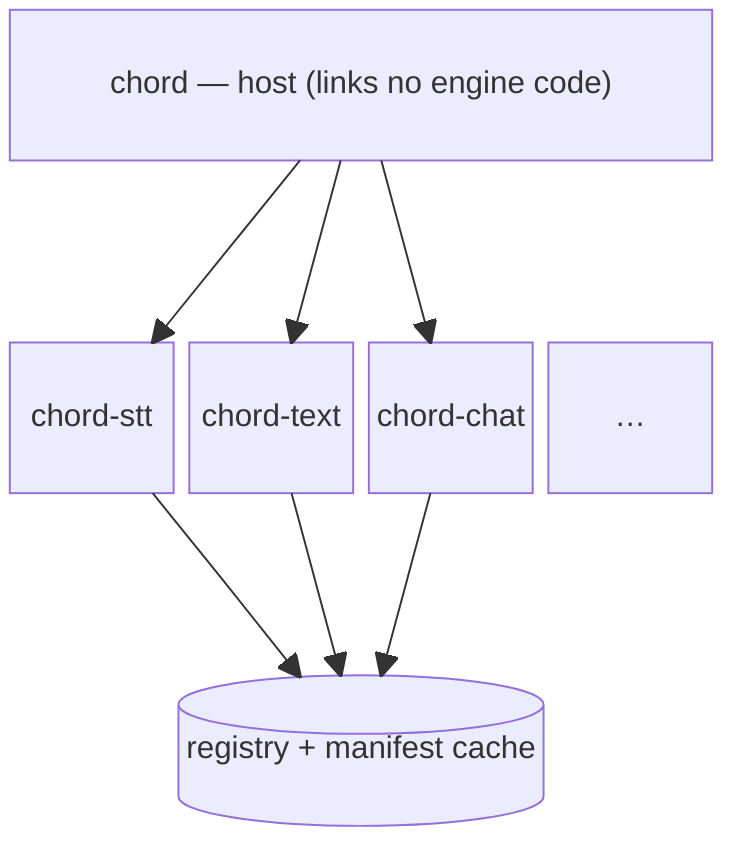

# chord

Compose local AI models as Unix filters. Each transform reads a *message* (an
ordered list of typed parts) on stdin and writes one on stdout, so you chain them
with the shell pipe. Everything runs locally.

```sh
cat question.wav | chord stt | chord text | chord tts | aplay
#                  audio→text   text→text    text→audio
```

A transform is a function `message -> message`. The mono-modal verbs (`stt`,
`tts`, `text`, `see`, `draw`) are the one-part-in/one-part-out case; `chat` is the
general multimodal case — text, images, and audio in one prompt.

## Transforms

| Verb | Kinds | Backend |
|---|---|---|
| `stt` | audio → text | whisper.cpp (also `--backend llama.cpp` / `sherpa-onnx`) |
| `tts` | text → audio | Supertonic / ONNX |
| `text` | text → text | llama.cpp |
| `chat` | text · image · audio → text | mistral.rs (multimodal) |
| `see` | image → text | llama.cpp (vision) |
| `draw` | text → image | stable-diffusion.cpp |
| `redact` | text → text | ONNX (PII filter) |
| `pack` · `unpack` | message ↔ parts | assemble / inspect a multimodal message |
| `vad` · `langid` · `diarize` | audio → text | sherpa-onnx |

`chord ls` lists installed engines; `chord <verb> --help` shows its flags;
`--backend <id>` picks an alternate where one exists.

## Install

Needs a Rust toolchain. Install the host plus each engine you want — they land in
`~/.cargo/bin`, where `chord` discovers them by name (adding one needs no host
change):

```sh
cargo install --path crates/chord-cli   # the `chord` host
for e in stt tts text chat see draw redact pack unpack vad langid diarize stt-sherpa stt-llama; do
  cargo install --path crates/transforms/chord-$e
done
```

The sherpa-onnx engines also need their shared libs beside the binary:

```sh
cp target/release/libsherpa-onnx-c-api.so target/release/libonnxruntime.so ~/.cargo/bin/
```

## Models

Each engine resolves its model via `--model`, config, or a default path, and exits
with a hint if it's missing. Models live under `~/.local/share/chord/models`.
`chord pull <verb>` fetches a default where one exists; `--model
hf:org/repo[:quant-or-file]` pulls from Hugging Face. Each engine also honors
`$CHORD_<NAME>_MODEL`.

```sh
chord pull stt                                   # whisper large-v3-turbo
chord text --model hf:org/repo:Q4_K_M "hello"
```

## Usage

```sh
chord <verb> [input] [--flags]   # input: a file path, or stdin if omitted
```

```sh
# describe an image, translate the answer, speak it
chord see photo.jpg --prompt "what is this?" \
  | chord text --system "translate to German" | chord tts | aplay

# text to image
echo "a lighthouse at sunset" | chord draw --steps 6 > out.png

# multimodal: an image and a spoken question in one prompt
chord chat --image cat.png --audio question.wav "Answer the question about the image"
```

Build a multimodal message explicitly with `pack`, inspect it with `unpack`:

```sh
chord pack --image cat.png --text "what is this?" --audio q.wav | chord chat
chord pack --image cat.png --text "what is this?"               | chord unpack --manifest
```

## Pipelines

Shell pipes work directly — each stage is its own process. `chord pipeline` runs a
chain as one command, stages separated by `::`: every stage spawns at once and is
wired with OS pipes (a true concurrent stream), with one up-front model check.

```sh
chord pipeline see photo.jpg --prompt "what is this?" :: text --system "translate to German" :: tts | aplay
```

## Configuration

Per-transform defaults in YAML, resolved from `--config <file>`, `$CHORD_CONFIG`,
`./chord.yaml`, then `~/.config/chord/config.yaml`. CLI flags override; `chord
config` shows the result.

```yaml
text:
  model: ~/models/qwen3-8b.gguf
  system: "Be concise."
```

## Scripting

Exit codes: `0` ok, `1` engine error, `2` bad input, `3` missing model.
`--format jsonl` emits lifecycle/error events on stderr (data stays on stdout):

```sh
$ printf '' | chord tts --format jsonl
{"event":"start","transform":"tts"}
{"event":"error","transform":"tts","code":2,"kind":"bad_input","message":"no input text"}
```

## Architecture

The core (`crates/chord-core`) defines `Kind`, `Message`/`Part` and the wire codec,
the `Transform` trait (`message -> message`, with a `Unary` shortcut for 1→1
engines), `Registry`, and `Manifest` — nothing else. A lone inline part is written
as raw bytes (mono-modal pipes stay raw); multi-part messages are framed.

Every engine is its own `chord-<name>` binary linking only its own native library;
the host (`crates/chord-cli`) links no engine code. Engines are **self-describing**:
each answers `--chord-manifest` with JSON, and the host discovers `chord-*` binaries
beside it and builds its registry from what's installed (manifests cached).



To run a chain, the host spawns every stage at once and connects them with OS
pipes — each stage a process, a *message* flowing down each pipe:


Out-of-process keeps incompatible native libraries apart (e.g. the two `ggml`
copies in llama.cpp and stable-diffusion.cpp), lets engines crash independently,
and makes adding a model just a new binary. Errors are categorized (`ChordError`),
logs are `tracing` on stderr, paths follow XDG.
